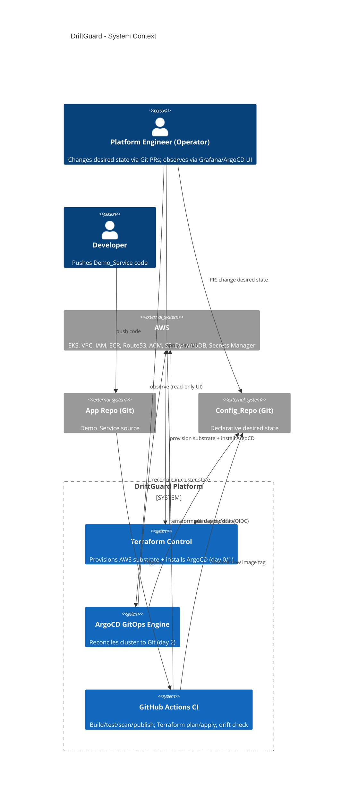
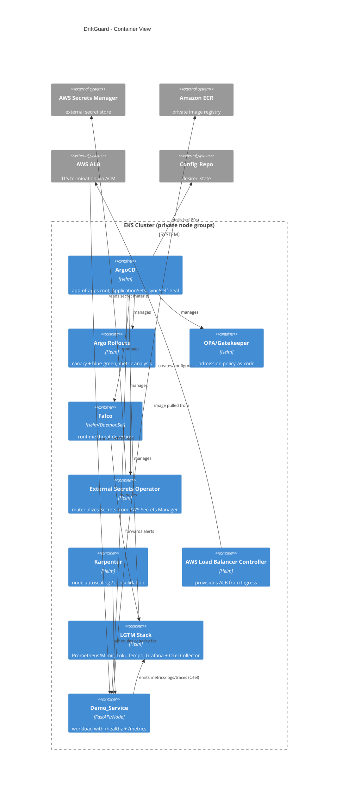
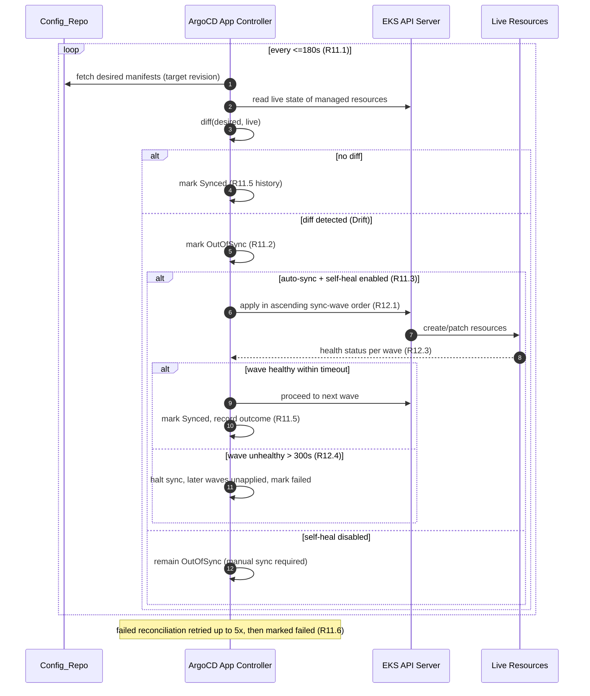
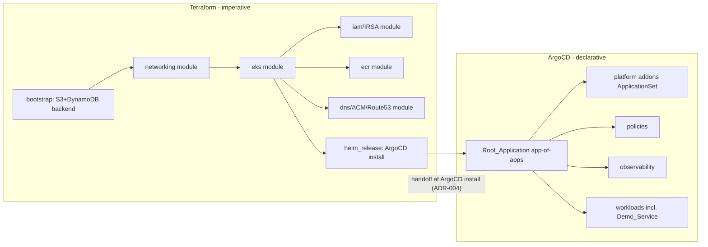
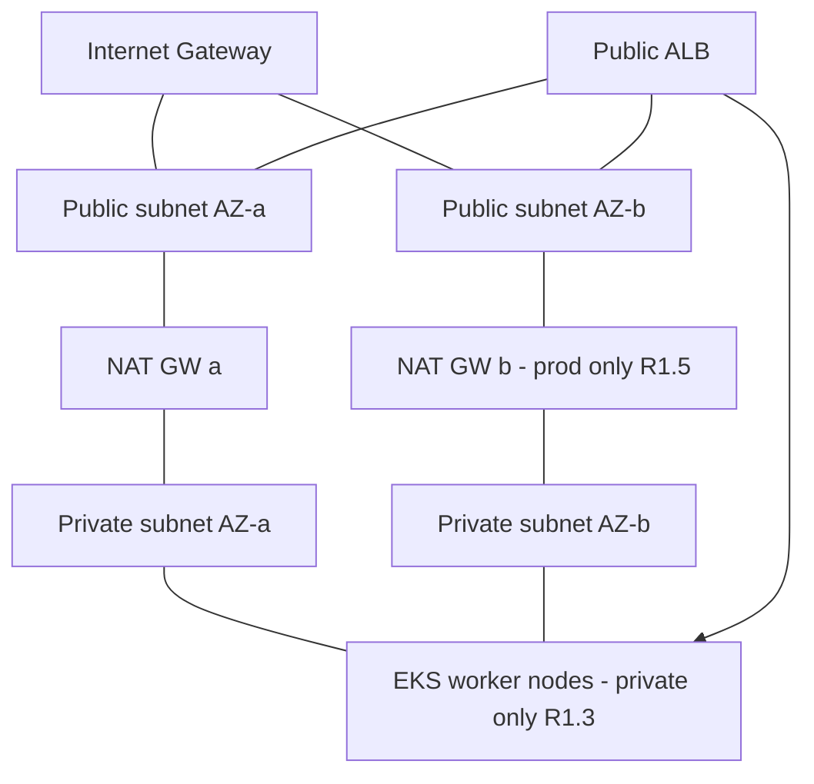
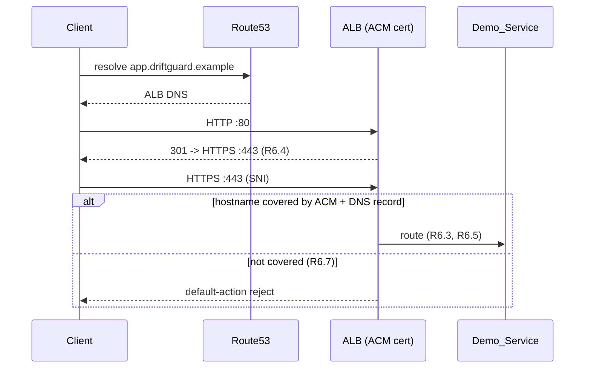
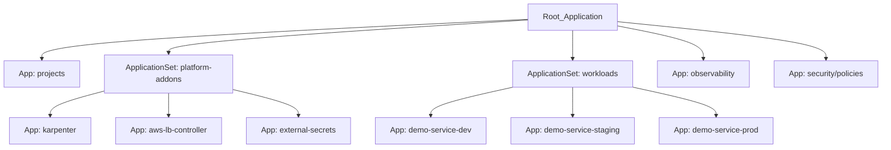
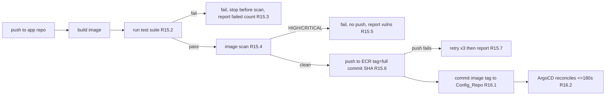
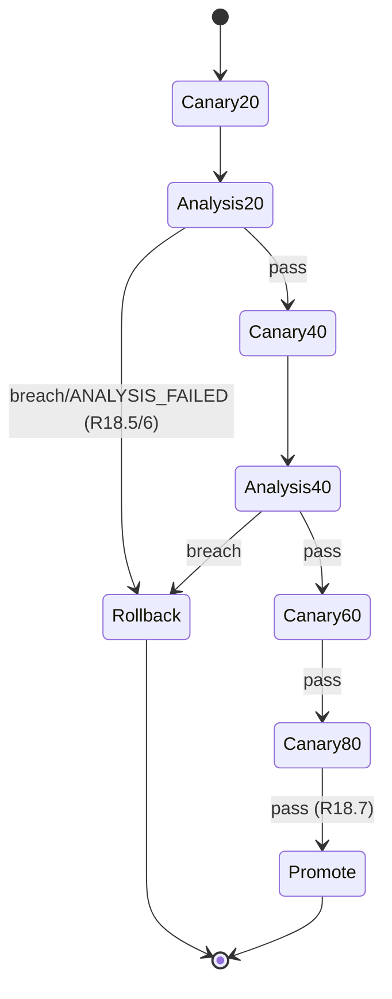
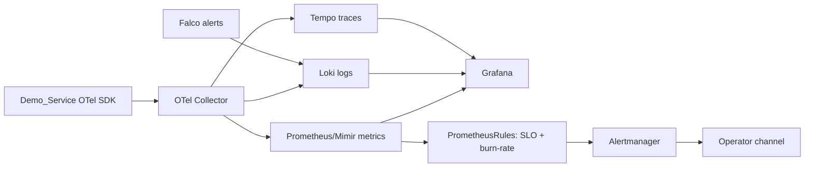

# Design Document: DriftGuard  -  GitOps Infrastructure Automation Platform

## Overview

DriftGuard is a GitOps Infrastructure Automation Platform on AWS EKS. Its defining behavior is
**drift detection and automatic reconciliation**: any deviation of live cluster or application state
from version-controlled desired state is detected and, where configured, self-healed.

The platform is built on a **two-layer control model**:

- **Layer A  -  Imperative provisioning (Terraform, "day 0/1").** Terraform creates the AWS substrate
  that cannot bootstrap itself from inside Kubernetes: VPC/networking, the EKS control plane and node
  groups, IAM/IRSA, ECR, Route53/ACM, the S3+DynamoDB state backend, and the *one-time install* of the
  in-cluster GitOps controller (ArgoCD) via the Helm provider. Terraform runs from CI or an operator
  workstation and is applied per environment. (Requirements 1, 2, 4, 5, 6, 7, 8, 9, 24, 26)

- **Layer B  -  Declarative reconciliation (ArgoCD, "day 2").** Once ArgoCD exists, *everything else*
  (platform add-ons, policies, observability, progressive-delivery controllers, and the demo workload)
  is delivered by ArgoCD pulling desired state from the `Config_Repo`. ArgoCD continuously compares live
  state to Git and converges the two. Humans and CI never `kubectl apply` to the cluster; they change Git.
  (Requirements 9–14, 16, 18–23, 25)

This separation is deliberate: Terraform owns resources whose lifecycle is external to Kubernetes and
whose creation is a prerequisite for the cluster to exist; ArgoCD owns everything that lives *inside* the
cluster so that it benefits from continuous drift correction. The boundary between the two layers is the
single most important architectural decision in the platform (see ADR-004).

### Design Goals and Non-Goals

| Goal | Driven by |
| --- | --- |
| Reproducible from an empty AWS account, fully documented, version-pinned | R27 |
| Continuous drift detection + opt-in self-heal as the core behavior | R11, R13 |
| Pull-based delivery boundary  -  no direct cluster mutation from CI | R16.4, R25.5 |
| Least-privilege everywhere (IRSA, IAM, ArgoCD RBAC/Projects) | R7, R14, R24 |
| Safe, ordered, non-destructive syncs (waves, opt-in prune) | R12, R13 |
| Safe releases with automated rollback | R18 |
| Full observability with SLOs and burn-rate alerting | R19, R20 |
| Policy-as-code + runtime security + no plaintext secrets in Git | R21, R22, R23 |
| Cost control and single-command teardown | R26 |

**Non-goals:** DriftGuard has **no custom web/mobile frontend**. The only user interfaces are the
ArgoCD web UI and Grafana dashboards, both provisioned as config-as-code. No bespoke UI code is written,
so UI rendering is out of scope for testing.

### Requirements Traceability Map

| Area | Requirements |
| --- | --- |
| Networking foundation | R1 |
| EKS cluster | R2 |
| Node autoscaling | R3 |
| Remote state | R4 |
| ECR | R5 |
| Ingress/DNS/TLS | R6 |
| IRSA | R7 |
| Module structure / env isolation | R8 |
| ArgoCD bootstrap | R9 |
| App-of-apps / ApplicationSets | R10 |
| Drift & reconciliation | R11 |
| Sync waves / ordering | R12 |
| Opt-in prune | R13 |
| ArgoCD RBAC / Projects | R14 |
| CI build/test/scan/publish | R15 |
| CI-driven GitOps update | R16 |
| Terraform CI + drift check | R17 |
| Progressive delivery | R18 |
| Telemetry collection | R19 |
| SLO / burn-rate | R20 |
| Policy-as-code | R21 |
| Runtime security | R22 |
| Secret management | R23 |
| Terraform security posture | R24 |
| Demo service | R25 |
| Cost / teardown | R26 |
| Reproducibility / docs | R27 |
| Crossplane (stretch) | R28 |

## Architecture

### C4 Level 1  -  System Context



### C4 Level 2  -  Container View (in-cluster)



### The Reconciliation Loop (core DriftGuard behavior)

ArgoCD runs a continuous control loop per Application. The loop is the heart of the platform and directly
implements R11 (drift detection), R12 (ordering), and R13 (opt-in prune).



**Drift injection test path (validates the core behavior):** an operator or test harness mutates a live
resource out-of-band (e.g., `kubectl scale`). Within one poll interval ArgoCD marks the owning Application
`OutOfSync`; if self-heal is enabled it reverts the change within the self-heal window (R11.3). This is the
E2E scenario in the Testing Strategy.

### Two Layers, One Timeline



## Repository and Module Layout

Two repositories separate the two control layers. This mirrors the Terraform/ArgoCD boundary and keeps the
pull-based delivery contract auditable (R16.4, R25.5).

### Terraform Repository (`driftguard-infra`)

```text
driftguard-infra/
├── bootstrap/                     # ONE-TIME: creates the state backend itself (chicken-and-egg)
│   ├── main.tf                    #   S3 state bucket (versioned, SSE) + DynamoDB lock table (R4)
│   └── README.md                  #   run with local state, then migrate
├── modules/                       # reusable, independently invocable modules (R8.1)
│   ├── networking/                # VPC, public/private subnets x2 AZ, IGW, NAT, route tables (R1)
│   ├── eks/                       # cluster (pinned k8s minor), managed node groups, OIDC (R2)
│   ├── iam/                       # IRSA roles, scoped trust + permission policies (R7, R24.1)
│   ├── ecr/                       # per-service private repos, scan-on-push, lifecycle (R5)
│   ├── dns/                       # Route53 zone + records, ACM cert + validation (R6)
│   └── addons-bootstrap/          # helm_release ArgoCD install + argocd Root_Application seed (R9)
├── live/                          # per-environment root configs, isolated state (R8.4)
│   ├── dev/
│   │   ├── backend.tf             #   distinct state key: env/dev/terraform.tfstate (R4.5)
│   │   ├── main.tf                #   module composition for dev
│   │   ├── terraform.tfvars       #   dev sizing: min/max/desired nodes, max node cap (R2.2, R3.5)
│   │   └── providers.tf           #   AWS provider ~> 5.0, all providers pinned (R8.2)
│   ├── staging/                   #   same shape, staging sizing
│   └── prod/                      #   same shape, prod sizing (1 NAT per AZ  -  R1.5)
├── policies/                      # tfsec/Checkov config + custom conftest rego for plan JSON (R24)
├── .github/workflows/             # (see CI/CD design) terraform-plan, terraform-apply, drift-check
└── versions.tf                    # shared required_version + provider constraints
```

**Directory responsibilities**

| Path | Responsibility | Requirements |
| --- | --- | --- |
| `bootstrap/` | Create the S3 bucket + DynamoDB table that back all other state. Run once per account, uses local state then migrates. | R4.1, R4.4 |
| `modules/networking` | All VPC/subnet/NAT/IGW/route topology; tags every resource. | R1 |
| `modules/eks` | EKS control plane (pinned minor), managed node groups, OIDC provider, API allowlist. | R2 |
| `modules/iam` | One IRSA role per workload; enumerated actions/ARNs; single-namespace/SA trust. | R7, R24.1 |
| `modules/ecr` | One private repo per service; encryption; scan-on-push; untagged-image lifecycle. | R5 |
| `modules/dns` | Hosted zone, records to ALB, ACM cert covering all hostnames, DNS validation. | R6 |
| `modules/addons-bootstrap` | Install ArgoCD via Helm; create the Root_Application. The handoff point. | R9 |
| `live/<env>` | Compose modules for one environment; independent backend key; env-specific sizing/caps. | R8.4, R8.5, R2.2, R3.5, R26.5 |
| `policies/` | Static-security scanning config + custom conformance rules over `terraform plan` JSON. | R24 |

### GitOps Config Repository (`driftguard-gitops` / `Config_Repo`)

```text
driftguard-gitops/
├── bootstrap/
│   └── root-app.yaml              # Root_Application (app-of-apps entrypoint) (R9.2, R10.1)
├── projects/                      # ArgoCD AppProjects: enumerated repos/clusters/namespaces (R14.1, R14.2)
│   ├── platform-addons.yaml
│   ├── observability.yaml
│   ├── security.yaml
│   └── workloads.yaml
├── applicationsets/               # generators  -  one App per target from a shared template (R10.2)
│   ├── platform-addons-appset.yaml
│   └── workloads-appset.yaml
├── addons/                        # platform add-ons as Helm/Kustomize (delivered by ArgoCD)
│   ├── argo-rollouts/             # R18.1
│   ├── aws-load-balancer-controller/  # R6.3
│   ├── karpenter/                 # R3.1
│   ├── external-secrets/          # R23.1
│   ├── gatekeeper/                # R21.1
│   └── falco/                     # R22.1
├── observability/
│   ├── kube-prometheus-stack/     # Prometheus/Mimir + Grafana (R19.1)
│   ├── loki/                      # logs (R19.1)
│   ├── tempo/                     # traces (R19.1)
│   ├── otel-collector/            # OpenTelemetry pipeline (R19.2)
│   ├── dashboards/                # dashboards-as-code (ConfigMap/sidecar) (R20.1, R19.5)
│   └── slo/                       # PrometheusRules: SLO recording + multi-window burn-rate (R20.3)
├── policies/                      # Gatekeeper ConstraintTemplates + Constraints (R21.3, R21.5)
│   ├── constrainttemplates/
│   └── constraints/
├── workloads/
│   └── demo-service/
│       ├── base/                  # Kustomize base: Rollout, Service, Ingress, ServiceAccount
│       └── overlays/{dev,staging,prod}/   # per-env overlays incl. image tag (R16.1) & IRSA annotation
├── secrets/                       # ONLY ExternalSecret refs + SecretStore  -  never plaintext (R23.3)
└── rollouts/                      # AnalysisTemplates (error-rate, p95 latency) (R18.4)
```

**Directory responsibilities**

| Path | Responsibility | Requirements |
| --- | --- | --- |
| `bootstrap/root-app.yaml` | The single Application ArgoCD is seeded with; references all children. | R9.2, R10.1 |
| `projects/` | Security boundary: each AppProject whitelists source repos + destination namespaces; default-deny. | R14.1, R14.2 |
| `applicationsets/` | Fan-out: generate one Application per target (env/service) from one template. | R10.2, R10.3 |
| `addons/` | Platform controllers as pinned Helm charts / Kustomize. | R3, R6, R18, R21, R22, R23 |
| `observability/` | LGTM stack, OTel pipeline, dashboards-as-code, SLO + burn-rate rules. | R19, R20 |
| `policies/` | Gatekeeper templates + constraints, reconciled from Git. | R21.3, R21.5 |
| `workloads/demo-service/overlays/<env>` | Per-env desired state; the image tag CI commits to. | R16.1, R25.4 |
| `secrets/` | External-secret references only; CI/pre-commit rejects plaintext. | R23.3, R24.4 |
| `rollouts/` | AnalysisTemplates consumed by canary/blue-green rollouts. | R18.4 |

All Helm charts and tool versions are pinned to exact identifiers (R27.5); a shared `versions` manifest or
each chart's `targetRevision`/`version` records the exact release.

## Components and Interfaces

This section details each component, its inputs/outputs, and the interfaces between them. It is organized
by concern: Infrastructure, GitOps, CI/CD, Progressive Delivery, Observability, Security, and the Demo
Service.

### 1. Infrastructure Design (Terraform, day 0/1)

#### 1.1 Network topology (R1)



- One VPC per environment; ≥1 public + ≥1 private subnet across ≥2 AZs (R1.1).
- Worker nodes live **only** in private subnets (R1.3); the ALB sits in public subnets.
- Non-prod: single NAT gateway (cost). Prod: one NAT per AZ for HA (R1.5).
- Public route tables → IGW (R1.6); private route tables → NAT (R1.7).
- Every network resource tagged `Environment`, `Project`, `ManagedBy` (R1.4, R8.7).

#### 1.2 EKS cluster + node groups (R2, R3)

- Cluster Kubernetes version pinned to an explicit minor (e.g., `1.30`), never `latest` (R2.1).
- At least one managed node group with explicit `min`/`max`/`desired` per environment (R2.2).
- OIDC provider enabled for IRSA (R2.3).
- Public API endpoint restricted to a CIDR allowlist; `0.0.0.0/0` forbidden (R2.4, R2.5).
- Outputs: `cluster_endpoint`, `cluster_ca_data`, `oidc_provider_arn`, `oidc_issuer_url` (R2.6). On
  create failure, no connection outputs are produced (R2.7  -  natural Terraform behavior; asserted in tests).

**Node autoscaling  -  Karpenter (ADR-001).** Karpenter is chosen over Cluster Autoscaler for faster,
bin-packed provisioning and native consolidation.

| Behavior | Mechanism | Requirement |
| --- | --- | --- |
| Provision on pending pods within ≤300s | Karpenter `NodePool` + provisioner watches unschedulable pods | R3.2 |
| Consolidate under 50% util for ≥600s | `consolidationPolicy: WhenUnderutilized` + `consolidateAfter` | R3.3 |
| Never strand pods when consolidating | Karpenter simulates scheduling before terminating | R3.4 |
| Max node cap per env | `NodePool.limits` (cpu/nodes) mapped from `terraform.tfvars` | R3.5, R26.5 |
| Do not exceed cap; leave pods pending | `limits` hard-stop | R3.6, R26.6 |

Karpenter itself is installed as a platform add-on via ArgoCD; its controller IAM role is created by the
`iam` module (IRSA). The node cap is a Terraform variable (whole number 1–1000, R26.5) surfaced into the
Karpenter `NodePool` limits via the Config_Repo overlay.

#### 1.3 Remote state backend (R4)

- S3 bucket: SSE enabled (R4.1), versioning enabled (R4.4).
- DynamoDB lock table: lock acquired before any state mutation (R4.2); conflicting op is blocked and the
  lock holder reported (R4.3); lock released on completion/abort (R4.6); unreachable table aborts the op
  (R4.7).
- Per-environment isolation via distinct state keys `env/<env>/terraform.tfstate` (R4.5, R8.4).

#### 1.4 ECR (R5)

- One private repository per deployable service, unique per environment (R5.1, R5.5).
- Encryption at rest (R5.2), scan-on-push (R5.3), lifecycle expiring untagged images >14d default (R5.4),
  required tags (R5.6).

#### 1.5 Ingress / DNS / TLS (R6)



- Route53 public hosted zone + records to the ALB (R6.1); ACM cert covering every external hostname (R6.2).
- ALB provisioned by the AWS Load Balancer Controller from Kubernetes `Ingress` (controller is a Git-managed
  add-on). HTTPS on 443 using the ACM cert (R6.3, R6.5); HTTP 80 → 301 HTTPS (R6.4).
- ACM DNS validation with a timeout; on timeout the apply fails and the HTTPS listener is not created (R6.6).
- Requests for uncovered hostnames are rejected by ALB default action (R6.7).

#### 1.6 IRSA (R7)

- One OIDC-federated IAM role per workload needing AWS access (R7.1).
- Policies enumerate specific actions + resource ARNs; no wildcard action **and** wildcard resource (R7.2,
  R24.1).
- Trust policy restricts each role to a single `namespace:serviceaccount` bound to the cluster OIDC provider
  (R7.4). Unmapped SAs get no credentials (R7.5); mismatched namespace/SA → assume-role denied (R7.6).

#### 1.7 Provider pinning & tagging (R8, R24)

- `required_version` set; AWS provider `~> 5.0`; every provider pinned (R8.2). A missing constraint fails
  before apply (R8.3  -  enforced by a CI conformance check).
- Exactly `Environment`, `Project`, `ManagedBy` applied to every taggable resource via provider
  `default_tags` **and** verified by a conformance check over plan JSON (R8.7, R8.8). Cost-allocation tags
  (Environment, Project) are a subset (R26.4).

### 2. GitOps Design (ArgoCD, day 2)

#### 2.1 Install & bootstrap (R9)

- ArgoCD installed by Terraform via the Helm provider in `modules/addons-bootstrap` (R9.1). Install is
  successful only when all control-plane components are Healthy/Ready within ≤600s (R9.1); otherwise the
  install is reported failed with the unhealthy component and the Root_Application is **not** created (R9.5).
- A `Root_Application` (app-of-apps) is seeded pointing at `Config_Repo/bootstrap/root-app.yaml` (R9.2).
- Root_Application discovers and creates all children within ≤180s (R9.3).
- ArgoCD's own config is declarative state in the Config_Repo  -  ArgoCD manages ArgoCD (R9.4).
- Unreachable repo or invalid child → Root_Application `Degraded`, error reported, existing children
  untouched (R9.6).

#### 2.2 App-of-apps + ApplicationSets (R10)



- Each managed service is a child Application referenced (directly or via generator) by the Root_Application
  (R10.1).
- At least one ApplicationSet generates exactly one Application per target from a shared template (R10.2).
  Adding a target creates its App within ≤300s with no manual config (R10.3); removing a target removes only
  that App (R10.4); malformed definitions are rejected without disturbing existing Apps (R10.5).

#### 2.3 Drift detection, sync policy, ordering, prune (R11–R13)

| Setting | Value | Requirement |
| --- | --- | --- |
| Reconcile / poll interval | ≤180s (`timeout.reconciliation`) | R11.1, R11.4 |
| Self-heal window | ≤120s after drift | R11.3 |
| Sync retry | up to 5 attempts, then failed | R11.6 |
| Sync waves | `argocd.argoproj.io/sync-wave` ascending; wave N healthy before N+1 | R12.1, R12.3 |
| Wave health timeout | 300s default → halt, later waves unapplied | R12.4 |
| CreateNamespace | per-Application `syncOptions: CreateNamespace=true` | R12.2, R12.5 |
| Prune | **opt-in per Application only**, never global | R13.1, R13.5 |

Auto-sync + self-heal is enabled on Applications that should converge automatically (R11.3). Pruning is
disabled by default; an Application must explicitly set `prune: true` to delete orphaned resources, and that
setting is per-Application (R13.1–R13.3). A failed prune retains the resource and records a failed-prune
outcome (R13.4). Prune is never enabled at a global/default scope (R13.5).

#### 2.4 Projects + RBAC hardening (R14)

- Every Application is assigned to an AppProject that enumerates permitted source repos, destination
  clusters, and destination namespaces (R14.1); anything not enumerated is denied by default (R14.2).
- A sync to a non-enumerated destination is rejected, applies nothing, and records a retrievable policy
  violation (R14.3).
- RBAC is least-privilege: each Operator role gets only explicitly assigned permissions; everything else is
  denied (R14.4) and denials are recorded (R14.5).
- Once an SSO/alternative auth method is verified to authenticate an admin, the built-in `admin` account is
  disabled (R14.6) and subsequent `admin` logins are rejected (R14.7).

### 3. CI/CD Design (GitHub Actions)

All AWS access from CI uses **GitHub OIDC federation** to assume short-lived IAM roles  -  no long-lived
access keys are stored (R24.4 spirit; enforced as a decision). The delivery boundary is strict: **CI never
runs `kubectl apply`** against the cluster (R16.4, R25.5).

#### 3.1 Application CI (`app-ci.yaml`)



- Build within 15 min of push (R15.1); run tests (R15.2); on test failure stop before scan and report failed
  count (R15.3).
- Image security scan (e.g., Trivy) (R15.4); any HIGH/CRITICAL fails the build, no image pushed, vulns
  reported (R15.5).
- On success, push to ECR tagged with the **full commit SHA** (R15.6); push failure retries ×3 then reports
  without leaving a partial tag (R15.7). Any stage failure stops the rest and reports which stage failed
  (R15.8).
- After push, CI commits the new image tag into the Config_Repo overlay (R16.1); ArgoCD then reconciles the
  Demo_Service within ≤180s (R16.2, R25.4). A failed Config_Repo commit stops and leaves the repo unchanged
  (R16.3).

#### 3.2 Terraform CI

- `terraform-plan.yaml` (on PR): `terraform plan` for the affected env, plan output posted to the PR (R17.1).
  Also runs `terraform validate`, `tflint`, and the security scan (R24.5) + conformance checks. Plan failure
  fails the check, posts output, applies nothing (R17.5). HIGH/CRITICAL security findings fail the check and
  block merge (R24.6).
- `terraform-apply.yaml` (on merge): `terraform apply` for the affected env only (R17.2); apply failure halts,
  reports the failing resource, leaves the env in pre-apply state (R17.6, R8.6).
- `drift-check.yaml` (scheduled, default 24h): `terraform plan -detailed-exitcode` per env (R17.3). Exit code
  `2` → drift reported with env + differing resources (R17.4); exit code `0` → no-drift status reported
  (R17.8); exit code `1` → check reported failed and env **not** reported drift-free (R17.7).

### 4. Progressive Delivery (Argo Rollouts) (R18)

- Argo Rollouts deployed as an add-on (R18.1); Demo_Service supports both canary and blue-green (R18.2).
- Canary steps 20/40/60/80/100%, each held 300s (R18.3).
- At each step an AnalysisRun evaluates error-rate vs 5% and p95 latency vs 500ms over the preceding 300s
  window, querying Prometheus (R18.4).
- Breach → abort within 60s, roll back all traffic to previous stable, record failed with breaching metric
  (R18.5). Metrics unavailable/slow (>60s) → `ANALYSIS_FAILED`, abort, roll back (R18.6). All steps pass →
  promote to 100%, record succeeded (R18.7).



### 5. Observability Design (LGTM + OpenTelemetry) (R19, R20)



- LGTM stack deployed as add-ons; deployment successful only when all components Healthy/Ready ≤600s (R19.1).
- Demo_Service emits metrics, logs, traces via OpenTelemetry (R19.2); traces queryable in Grafana ≤30s
  (R19.3). Retention: metrics ≥15d, logs ≥7d, traces ≥3d (R19.4); expired telemetry discarded (R19.7).
- Dashboards populate ≤10s on open/refresh (R19.5). Partial signal failure: continue unaffected signals,
  report the failed one (R19.6); all three failing → report all three, stop collecting until one recovers
  (R19.8).
- **SLOs (R20):** ≥1 SLO for Demo_Service with explicit SLI and target % over a rolling window (default 28d)
  (R20.1). SLO dashboard shows attainment + remaining error budget using telemetry ≤60s old (R20.2).
  Multi-window (long + short) burn-rate alert fires and is delivered to a notification channel (R20.3).
  Insufficient telemetry → attainment/budget shown `unknown`, not reported compliant, missing telemetry
  indicated (R20.4). Optional DORA metrics panel (R20.5).
- Dashboards, SLO recording rules, and burn-rate `PrometheusRules` are all config-as-code in the Config_Repo.

### 6. Security & Policy Design (R21–R24)

#### 6.1 Admission control  -  OPA/Gatekeeper (R21)

- Gatekeeper deployed as add-on; Healthy/Ready ≤600s or reported failed (R21.1).
- Baseline `ConstraintTemplates` + `Constraints`: block privileged containers (R21.2), block host
  namespaces (hostPID/hostIPC/hostNetwork), require labels Environment/Project/ManagedBy (R21.3).
- Compliant workloads admitted (R21.4). Policies are declarative in Config_Repo; changes reconcile ≤180s
  (R21.5). Evaluation failure → reject admission (fail-closed) and report (R21.6).

#### 6.2 Runtime security  -  Falco (R22)

- Falco DaemonSet as add-on; Healthy/Ready ≤600s (R22.1) or reported failed with component (R22.4).
- Matching activity → alert identifying rule/workload/severity ≤30s (R22.2); forwarded to Observability_Stack
  ≤30s (R22.3). Forward failure retries ×3, retains the alert, reports after exhaustion (R22.5).

#### 6.3 Secrets  -  External Secrets Operator (R23) (ADR-002)

- ESO deployed on cluster provision; ready ≤300s (R23.1). Materializes K8s Secrets from AWS Secrets Manager
  ≤60s of deployment request (R23.2). Config_Repo stores only references/ciphertext; plaintext commits/applies
  are rejected (R23.3, R24.4). Store timeout (>30s after 3 retries) → mark sync failed identifying the store
  (R23.4); store unreachable → leave Secret unpopulated, preserve previously materialized values (R23.5).

#### 6.4 Terraform security posture (R24)

- No policy statement combines wildcard action + wildcard resource (R24.1). Encryption at rest for S3 state,
  ECR, EKS secrets (R24.2). No SG ingress from `0.0.0.0/0` (or `::/0`) to ports 22/3389 (R24.3). No hardcoded
  secrets in TF/varfiles (R24.4). CI runs tfsec/Checkov, reports findings+severity ≤300s (R24.5); HIGH/CRITICAL
  (incl. hardcoded secrets) fail validation and block merge (R24.6).

### 7. Demo Service Design (R25)

- A small **FastAPI** microservice (Python)  -  chosen for concise OTel auto-instrumentation and a native
  Prometheus exporter.

```text
demo-service/
├── app/
│   ├── main.py            # routes: /healthz (readiness), /metrics (Prometheus), / (work)
│   └── telemetry.py       # OTel SDK setup (metrics/logs/traces) (R19.2)
├── tests/                 # pytest suite run by CI (R15.2)
├── Dockerfile             # multi-stage, non-root, minimal base (Gatekeeper-compliant R21.2)
├── pyproject.toml
└── chart-note.md          # deployment is via Kustomize base in Config_Repo, not a local chart
```

- `/healthz`: returns success ≤2s when ready (R25.2); returns not-ready failure status when not ready, never
  falsely reporting ready (R25.3). Wired to the Rollout/Deployment readiness probe.
- `/metrics`: Prometheus exposition format ≤2s (R25.6).
- Deployed **only** via ArgoCD reconciliation of the Config_Repo (R25.4, R25.5)  -  never by direct apply.
- The Dockerfile runs as non-root with no privileged flags and carries required labels so it passes admission
  (R21.2, R21.3).

**Pipeline flow (dev → prod):** developer pushes → app CI builds/tests/scans → pushes image `:<sha>` to ECR
→ commits tag into `workloads/demo-service/overlays/dev` → ArgoCD reconciles dev → promotion PRs advance the
tag to staging/prod overlays → Argo Rollouts runs canary analysis at each env.

### 8. Cost Control & Teardown (R26)

- **Single-command teardown per env:** `terraform destroy` on `live/<env>` destroys all env resources (R26.1);
  after completion, zero billable compute, zero NAT gateways, zero load balancers remain (R26.2). Partial
  failure reports each remaining resource, marks teardown incomplete, and leaves remaining resources
  unmodified so it is safe to re-run (R26.3). A wrapper script drains in-cluster LB-backed Services first so
  the ALB is removed before `destroy`.
- Cost-allocation tags (Environment, Project) on every taggable resource (R26.4).
- Max node count per env, whole number 1–1000 (R26.5); scaling beyond cap is rejected and reported (R26.6).
- **Cost levers:** Karpenter spot instances + right-sizing + consolidation (R3.3), single NAT in non-prod,
  small managed node group, aggressive ECR lifecycle (R5.4).

**Estimated cost per environment (indicative, us-east-1, subject to change):**

| Line item | dev (single NAT, spot) | staging | prod (NAT/AZ, on-demand baseline) |
| --- | --- | --- | --- |
| EKS control plane | $0.10/hr | $0.10/hr | $0.10/hr |
| NAT gateway(s) | $0.045/hr | $0.045/hr | $0.135/hr (×3 AZ) |
| Worker nodes | ~$0.05/hr (spot, capped) | ~$0.12/hr | ~$0.40/hr |
| ALB | $0.0225/hr | $0.0225/hr | $0.0225/hr |
| **Hourly (approx)** | **~$0.22/hr** | **~$0.29/hr** | **~$0.66/hr** |
| **Monthly (approx)** | **~$160/mo** | **~$210/mo** | **~$480/mo** |

Each environment's `live/<env>` documents its own hourly + monthly estimate (R26.7); figures above are
placeholders to be refined during implementation with the AWS Pricing Calculator.

### 9. Crossplane (Stretch) (R28)

When enabled by a feature flag, Crossplane + AWS provider is installed as a Git-managed add-on; Healthy/Ready
≤600s or reported failed and claims rejected (R28.1, R28.2). A claim applied via GitOps provisions the AWS
resource ≤900s and records ready (R28.3); provision failure records failure, reports to Operators, not ready
(R28.4). Claim deletion deprovisions ≤900s leaving no billable resource (R28.5); deprovision failure retains
deletion state, reports, not reported removed (R28.6). Disabled by default to control cost and scope.

## Data Models

DriftGuard is declarative; its "data models" are the schemas of the configuration artifacts and the derived
inputs that conformance tests reason over. These schemas are what the Correctness Properties quantify across.

### Terraform inputs (per environment)

```hcl
# live/<env>/terraform.tfvars  -  conceptual schema
environment          = "dev|staging|prod"      # R8.4
project              = "driftguard"            # tag value R8.7
kubernetes_version   = "1.30"                  # explicit minor, no 'latest' (R2.1)
node_group = {
  min_size     = number                        # R2.2
  max_size     = number                         # R2.2
  desired_size = number                         # R2.2
}
max_node_count       = number   # whole number 1..1000, Karpenter limit (R3.5, R26.5)
api_allowed_cidrs    = list(string)             # non-empty, no 0.0.0.0/0 (R2.4, R2.5)
nat_per_az           = bool                     # true only in prod (R1.5)
ecr_untagged_expiry_days = number               # default 14 (R5.4)
required_tags        = { Environment, Project, ManagedBy }  # exactly these (R8.7, R8.8)
```

### Required tag set (universal)

```json
{ "Environment": "<env>", "Project": "driftguard", "ManagedBy": "terraform" }
```
Every taggable AWS resource carries exactly this set (R8.7); cost-allocation subset is {Environment, Project}
(R26.4).

### ArgoCD AppProject (destination allowlist)

```yaml
# projects/<name>.yaml  -  conceptual schema (R14.1, R14.2)
spec:
  sourceRepos: ["https://github.com/<org>/driftguard-gitops.git"]  # enumerated only
  destinations:
    - server: https://kubernetes.default.svc
      namespace: <enumerated-namespace>        # anything else denied by default
  clusterResourceWhitelist: [...]              # enumerated kinds only
```

### ArgoCD Application sync policy

```yaml
# conceptual schema for a managed Application (R11–R13)
spec:
  project: <appproject>                         # must reference an enumerated Project (R14.1)
  syncPolicy:
    automated:
      selfHeal: true|false                      # R11.3
      prune: true|false                         # default false, opt-in (R13.1, R13.5)
    syncOptions: ["CreateNamespace=true"]       # opt-in per app (R12.2)
    retry: { limit: 5 }                          # R11.6
  # resources annotated argocd.argoproj.io/sync-wave: "<int>" (R12.1)
```

### IAM policy statement (IRSA + Terraform)

```json
{
  "Effect": "Allow",
  "Action": ["service:SpecificAction"],   // never "*" combined with "*" resource (R7.2, R24.1)
  "Resource": ["arn:aws:...:specific"],    // enumerated ARNs
  "Condition": { "StringEquals": { "<oidc>:sub": "system:serviceaccount:<ns>:<sa>" } }  // R7.4
}
```

### Rollout AnalysisTemplate (thresholds)

```yaml
# rollouts/analysis-*.yaml (R18.4)
metrics:
  - name: error-rate      # fail if > 0.05 (5%) over 300s window
  - name: p95-latency-ms  # fail if > 500 over 300s window
```

### SLO definition

```yaml
# observability/slo/*.yaml (R20.1)
slo:
  sli: "successful_requests / total_requests"
  target_percent: 0.0..100.0
  rolling_window_days: 28            # default
  burn_rate:
    long_window / short_window with threshold  # R20.3
```

### ExternalSecret reference (no plaintext)

```yaml
# secrets/*.yaml (R23.3)  -  reference only, never a value
spec:
  secretStoreRef: { name: aws-secrets-manager }
  data:
    - secretKey: <k8s-key>
      remoteRef: { key: <secretsmanager-path> }   # pointer, not the secret
```
## Correctness Properties

*A property is a characteristic or behavior that should hold true across all valid executions of a
system  -  essentially, a formal statement about what the system should do. Properties serve as the bridge
between human-readable specifications and machine-verifiable correctness guarantees.*

### Scope of property-based testing in DriftGuard

DriftGuard is predominantly Infrastructure-as-Code and declarative GitOps configuration, plus reliance on
external controllers (ArgoCD, Argo Rollouts, Karpenter, Gatekeeper's runtime webhook, Falco, External
Secrets Operator). Those parts are **not** suitable for property-based testing (PBT) and are validated with
snapshot/conformance checks, smoke tests, integration tests, and an end-to-end run (see Testing Strategy).

PBT is reserved for the bounded subset where **we author the logic and the output varies meaningfully with
input**:

- Terraform **conformance rules** evaluated over `terraform plan -json` (tags, IAM wildcards, security-group
  and API exposure)  -  the rules are code we write, and the input space of resource/statement/rule shapes is
  large.
- **OPA/Gatekeeper Rego** admission policies  -  pure decision functions over arbitrary pod specs.
- **ArgoCD manifest invariants** we enforce over the Config_Repo (opt-in prune, Project default-deny).
- The **no-plaintext-secrets** content scanner.
- **Node-cap validation** logic.

Each property below is universally quantified and traces to the requirement clause(s) it validates. Every
property test MUST run a minimum of 100 iterations and carry the tag
**Feature: gitops-platform, Property {number}: {property_text}**.

### Property 1: Universal tag completeness

*For any* taggable AWS resource configuration produced by the Terraform modules, its effective tag set
SHALL contain exactly the keys `Environment`, `Project`, and `ManagedBy` with non-empty values; a resource
missing any of the three SHALL be rejected before apply.

**Validates: Requirements 1.4, 5.6, 8.7, 8.8, 26.4**

### Property 2: IAM statements never combine wildcard action with wildcard resource

*For any* IAM policy statement authored by the `iam` module or any Terraform-defined policy, the statement
SHALL NOT simultaneously use a wildcard (`*`) action and a wildcard (`*`) resource.

**Validates: Requirements 7.2, 24.1**

### Property 3: IRSA trust policy binds exactly one namespace and service account

*For any* IRSA role trust policy, the OIDC `sub` condition SHALL match exactly one
`system:serviceaccount:<namespace>:<serviceaccount>` and SHALL NOT contain a wildcard or match more than
one service account.

**Validates: Requirements 7.4**

### Property 4: EKS API allowlist excludes unrestricted CIDRs

*For any* configured `api_allowed_cidrs` list, the list SHALL be non-empty and SHALL NOT contain
`0.0.0.0/0` or `::/0`; a list violating either condition SHALL be rejected before apply.

**Validates: Requirements 2.4, 2.5**

### Property 5: Security-group ingress never opens administrative ports to the world

*For any* security-group ingress rule, it SHALL NOT combine an unrestricted source (`0.0.0.0/0` or `::/0`)
with an administrative port (22 or 3389) within its port range.

**Validates: Requirements 24.3**

### Property 6: Gatekeeper baseline admission decision

*For any* Kubernetes workload spec, the Policy_Engine SHALL deny admission **if and only if** the spec
violates at least one baseline rule  -  a privileged container, use of a host namespace (hostPID, hostIPC, or
hostNetwork), or a missing required label (`Environment`, `Project`, or `ManagedBy`)  -  and SHALL admit the
workload when it violates none of them.

**Validates: Requirements 21.2, 21.3, 21.4**

### Property 7: Pruning is opt-in per Application and never global

*For any* set of ArgoCD Application manifests in the Config_Repo, an Application SHALL have pruning enabled
only when that Application explicitly opts in; an Application with no explicit opt-in SHALL have prune
disabled, and no global or default configuration SHALL enable prune for all Applications.

**Validates: Requirements 13.1, 13.5**

### Property 8: Every Application is bound to a default-deny Project

*For any* ArgoCD Application manifest, `spec.project` SHALL reference a defined AppProject, and *for any*
AppProject, its `sourceRepos`, `destinations`, and `clusterResourceWhitelist` SHALL be explicitly enumerated
with no wildcard (`*`) entry.

**Validates: Requirements 14.1, 14.2**

### Property 9: No plaintext secrets are committed to Git

*For any* file content committed under the Config_Repo (in particular the `secrets/` path), the content
SHALL contain only secret references or ciphertext and SHALL NOT contain a plaintext secret value; content
containing a plaintext secret SHALL be rejected by the pre-commit/CI scanner.

**Validates: Requirements 23.3, 24.4**

### Property 10: Node-count cap validation

*For any* configured `max_node_count`, it SHALL be accepted only when it is a whole number in the inclusive
range [1, 1000]; and *for any* scaling request against a valid cap, a request exceeding the cap SHALL be
rejected with the resulting node count clamped at or below the cap.

**Validates: Requirements 26.5, 26.6**

## Error Handling

Error handling in DriftGuard is dominated by **fail-safe / fail-closed** defaults: destructive or ambiguous
conditions must never silently proceed. Handling is organized by layer.

### Terraform (provisioning) errors

| Condition | Handling | Requirement |
| --- | --- | --- |
| `apply` fails to create EKS | Report failing resource; produce no connection outputs; env left in pre-apply state | R2.7, R8.6, R17.6 |
| State lock already held | Block the conflicting op, report the lock holder identity, leave state unchanged | R4.3 |
| DynamoDB lock table unreachable | Abort the op, report "lock could not be acquired", leave state unchanged | R4.7 |
| Lock lifecycle | Release any acquired lock on completion, block, or abort | R4.6 |
| Missing provider version constraint | Fail before apply; report which provider lacks a constraint | R8.3 |
| Missing required tag on a resource | Fail before apply; report which tag is missing | R8.8 |
| ACM validation exceeds timeout | Fail the apply; report cert unvalidated; do not create the dependent HTTPS listener | R6.6 |
| Apply targeting one env fails | Leave every other env in its pre-apply state; report the failed env | R8.6 |
| Teardown fails on some resources | Report each remaining resource; mark teardown incomplete; leave remainders unmodified so re-run is safe | R26.3 |

State-lock waits use a bounded `-lock-timeout`; CI never force-unlocks automatically (a stuck lock is
surfaced to Operators, not auto-cleared), because auto-unlock could corrupt shared state.

### ArgoCD (reconciliation) errors

| Condition | Handling | Requirement |
| --- | --- | --- |
| Install not Healthy/Ready ≤600s | Report install failed with the unhealthy component; do NOT bootstrap Root_Application | R9.5 |
| Config_Repo unreachable / invalid child | Mark Root_Application Degraded; report; leave existing children unchanged | R9.6 |
| Malformed ApplicationSet target | Do not generate that Application; report the rejected definition; leave existing Apps unchanged | R10.5 |
| Reconciliation fails | Retry up to 5 attempts; mark failed after final attempt; leave last known live state unchanged | R11.6 |
| Earlier sync wave unhealthy > 300s | Halt sync; leave later waves unapplied; mark failed with the offending wave | R12.4 |
| CreateNamespace fails | Halt sync; apply none of the app's namespaced resources; report namespace-create failure | R12.5 |
| Sync to non-enumerated destination | Reject sync; apply nothing; record a retrievable policy violation | R14.3 |
| Failed prune of an orphan | Retain the resource; record a failed-prune outcome in sync status | R13.4 |

### CI/CD errors

| Condition | Handling | Requirement |
| --- | --- | --- |
| Test suite fails | Fail build; stop before scan; report failed-test count | R15.3 |
| Scan finds HIGH/CRITICAL | Fail build; push no image; report each finding | R15.5 |
| ECR push fails | Retry ×3; report failure if exhausted; leave no partial tag | R15.7 |
| Any stage fails | Stop remaining stages; report which stage failed | R15.8 |
| Config_Repo commit fails | Stop; report the failing update; leave Config_Repo unchanged | R16.3 |
| `terraform plan` fails on PR | Fail the check; post output to PR; apply nothing | R17.5 |
| Drift check exit code `1` (error) | Report check failed; do NOT report env drift-free | R17.7 |
| TF security scan HIGH/CRITICAL | Fail validation; block merge; report findings | R24.6 |

Drift-check exit-code mapping is explicit: `0` → no-drift reported (R17.8); `2` → drift reported with env and
differing resources (R17.4); `1` → check-failed, never drift-free (R17.7).

### Progressive delivery, observability, security, secrets

| Condition | Handling | Requirement |
| --- | --- | --- |
| AnalysisRun metric breach | Abort ≤60s; roll back all traffic to previous stable; record failed with breaching metric | R18.5 |
| Metrics unavailable / slow (>60s) | Record `ANALYSIS_FAILED`; abort; roll back to previous stable | R18.6 |
| One telemetry signal fails | Continue collecting the unaffected signals; report the failed signal | R19.6 |
| All three signals fail | Report all three; stop collecting until at least one recovers | R19.8 |
| SLO telemetry insufficient | Show attainment/budget as `unknown`; do NOT report compliant; indicate missing telemetry | R20.4 |
| Gatekeeper cannot evaluate admission | Fail-closed: reject the workload; report evaluation could not complete | R21.6 |
| Falco alert forward fails | Retry ×3; retain the alert (never discard); report after exhaustion | R22.5 |
| External secret store timeout (>30s, 3 retries) | Mark the secret's sync failed, identifying the unreachable store | R23.4 |
| External secret store unreachable | Leave the Secret unpopulated; preserve previously materialized values (no overwrite) | R23.5 |
| Crossplane provision/deprovision failure | Record failure in claim status; report to Operators; do not mark ready/removed | R28.4, R28.6 |

## Testing Strategy

Testing follows a **dual approach**  -  example/integration tests for concrete behavior and external wiring,
and property tests for the authored-logic subset  -  layered into a pyramid that ends in a full end-to-end
smoke run.

### Layer 1  -  Static and conformance checks (fast, run on every PR)

- `terraform fmt -check`, `terraform validate`, `tflint` on every module and `live/<env>` root.
- `tfsec`/`Checkov` security scan; HIGH/CRITICAL fails the PR and blocks merge (R24.5, R24.6).
- `conftest`/OPA conformance rules over `terraform plan -json`: encryption-at-rest flags (R24.2), pinned
  provider constraints (R8.2/R8.3), pinned k8s minor (R2.1), NAT-per-AZ shape (R1.5), private-subnet node
  placement (R1.3), distinct backend keys per env (R8.4).
- `kubeconform` schema validation of every Kubernetes/ArgoCD/Rollout manifest in the Config_Repo.
- `conftest` policy tests over Config_Repo manifests for the ArgoCD invariants (feeds Properties 7 and 8).
- `Infracost` cost estimate posted to the PR (see Cost Control design; R26.7).

### Layer 2  -  Property-based tests (min 100 iterations each)

A property-testing library is used per language  -  **Hypothesis** (Python) for the conformance-rule and
scanner logic and the Demo_Service, and **OPA/conftest `test` + Gatekeeper `gator`** for the Rego policies.
Property-based testing is **not** implemented from scratch. Each test is tagged
**Feature: gitops-platform, Property {number}: {property_text}** and references its design property.

| Property | Test approach |
| --- | --- |
| P1 Tag completeness | Generate arbitrary resource tag maps; accept iff exactly the three keys present with non-empty values; plus conformance over real plan JSON. |
| P2 IAM no wildcard+wildcard | Generate random IAM statements (incl. `*`/`*` combinations); assert rejection. |
| P3 IRSA single ns:sa trust | Generate `sub` conditions; assert exactly-one, reject wildcard/multi. |
| P4 API allowlist | Generate CIDR lists (incl. `0.0.0.0/0`, `::/0`, empty); assert rejection of open/empty. |
| P5 SG admin ports | Generate ingress rules (source × port range); assert rejection of open-source-to-22/3389. |
| P6 Gatekeeper admission | Generate pod specs with controlled violation flags; assert deny iff any violation, admit iff none (OPA `test`/`gator`). |
| P7 Prune opt-in | Generate Application manifests; assert prune disabled unless explicit opt-in and no global prune. |
| P8 App→Project default-deny | Generate App+Project manifests; assert binding + no-wildcard enumeration. |
| P9 No plaintext secrets | Generate content with/without secret-shaped tokens; assert scanner rejects plaintext, accepts references. |
| P10 Node-cap validation | Generate (cap, request) pairs incl. boundaries {0,1,1000,1001,neg}; assert cap range + reject-over-cap clamped. |

### Layer 3  -  Unit and example tests

- Demo_Service (`pytest`): `/healthz` returns success ≤2s when ready (R25.2); returns a not-ready failure and
  never falsely reports ready when not ready (R25.3, edge case); `/metrics` returns Prometheus exposition
  format ≤2s (R25.6).
- Drift-check exit-code → status mapping unit test for `{0,1,2}` (R17.3/4/7/8).
- CI stage-gating with passing/failing fixtures: stop-before-scan on test failure (R15.3), no-push on
  HIGH/CRITICAL (R15.5), stop-and-report on any stage failure (R15.8).
- `promtool test rules` over the SLO recording rules and multi-window burn-rate alert with time-series
  fixtures (R20.3).
- Argo Rollouts **analysis dry-run** against seeded Prometheus data: clean metrics promote; breaching metrics
  abort and roll back (R18.5, R18.6).

### Layer 4  -  Integration tests (ephemeral environment)

- ArgoCD: Root_Application creates children ≤180s (R9.3); ApplicationSet generates/removes an App on
  target add/remove ≤300s (R10.3, R10.4); sync-wave ordering and halt-on-unhealthy-wave (R12).
- IRSA: annotated SA receives credentials for the mapped role only; unmapped SA denied (R7.3, R7.5, R7.6).
- State lock: hold a lock, attempt a second apply, assert block + holder identity (R4.3).
- Gatekeeper runtime webhook fail-closed (R21.6); ESO materializes a Secret ≤60s then preserves values when
  the store is broken (R23.2, R23.5); Falco triggers and forwards an alert ≤30s (R22.2, R22.3).

### Layer 5  -  End-to-end smoke (the DriftGuard acceptance scenario)

A single scripted run, executed against an ephemeral `dev` environment, that exercises the platform's
defining behaviors end to end (R27.2):

1. **Provision** from an empty account per the documented order (bootstrap → networking → eks → iam → ecr →
   dns → ArgoCD) and confirm ArgoCD + add-ons reach Healthy/Ready.
2. **Deploy the Demo_Service via GitOps** (CI pushes image, bumps the Config_Repo tag, ArgoCD reconciles) and
   confirm a successful HTTPS health check (R27.2).
3. **Induce drift**  -  mutate a live resource out-of-band (`kubectl scale`)  -  and observe ArgoCD mark
   `OutOfSync` ≤180s and self-heal ≤120s (R11.2, R11.3). *This is the core DriftGuard proof.*
4. **Induce a bad canary**  -  deploy a version that breaches the error-rate/latency thresholds  -  and observe
   Argo Rollouts abort and roll back to the previous stable version (R18.5).
5. **Teardown**  -  a single `terraform destroy` on the env leaves zero billable compute, NAT gateways, and
   load balancers (R26.1, R26.2).

### Test data and boundaries

Property generators must exercise boundary and adversarial inputs: empty/whitespace tag values, `*`/`::/0`
CIDRs, port-range edges (21/22/23, 3388/3389/3390), label sets missing exactly one required key, node caps
at {0, 1, 1000, 1001, negatives}, and secret-shaped tokens (AWS keys, PEM blocks, high-entropy strings).

## Architecture Decision Records

Short ADR-style notes for the decisions the design depends on. Each records the decision, the alternatives,
and the rationale.

### ADR-001: Karpenter over Cluster Autoscaler

**Decision:** Use Karpenter as the Node_Autoscaler.
**Alternatives:** Cluster Autoscaler (CA) with managed node group ASGs.
**Rationale:** Karpenter provisions right-sized nodes directly from pending-pod requirements (faster than CA's
ASG round-trips, easing the ≤300s window of R3.2), performs native consolidation to reclaim under-utilized
capacity (R3.3), and expresses hard caps via `NodePool.limits` (R3.5/R26.5). CA is simpler and AZ-aware for
stateful EBS pinning; if that becomes important, CA remains a fallback. Trade-off accepted: Karpenter needs
its own IRSA role and a slightly more involved bootstrap.

### ADR-002: External Secrets Operator over Sealed Secrets

**Decision:** Use External Secrets Operator (ESO) backed by AWS Secrets Manager.
**Alternatives:** Bitnami Sealed Secrets (encrypted secrets committed to Git).
**Rationale:** ESO keeps secret material entirely out of Git  -  only references live in the Config_Repo
(R23.3)  -  and centralizes rotation in Secrets Manager, with graceful handling when the store is unreachable
(R23.5). Sealed Secrets stores ciphertext in Git, which couples rotation to Git commits and risks a
compromised sealing key exposing history. Trade-off accepted: ESO adds a dependency on an external store and
an IRSA role to read it.

### ADR-003: Kustomize over Helm for per-environment workload overlays

**Decision:** Use Kustomize bases + `overlays/{dev,staging,prod}` for the Demo_Service and workload manifests;
reserve Helm for third-party add-on charts.
**Alternatives:** Helm umbrella charts with per-env `values.yaml`.
**Rationale:** Kustomize gives a clean base + overlay model where the only per-env delta the CI writes is the
image tag (R16.1), keeping the CI→GitOps commit minimal and diff-reviewable, and it avoids templating
indirection for first-party manifests. Helm remains the right tool for upstream components (ArgoCD, LGTM,
Gatekeeper, Falco, Karpenter, ESO) where the community chart is the interface and pinning `version`/
`targetRevision` gives reproducibility (R27.5). Trade-off accepted: two configuration idioms coexist, but each
is used where it is strongest.

### ADR-004: Helm-bootstrap of ArgoCD, GitOps-managed everything else

**Decision:** Install only ArgoCD (and the S3/DynamoDB backend, VPC, EKS, IAM, ECR, DNS) imperatively via
Terraform/Helm; deliver all other in-cluster components through ArgoCD from the Config_Repo.
**Alternatives:** (a) Terraform-manage all add-ons via the Helm provider; (b) a third-party bootstrap tool.
**Rationale:** This is the single most important boundary in the platform. Components required for the cluster
to *exist* or for GitOps to *start* cannot bootstrap themselves from inside GitOps, so Terraform owns them
(R9.1). Once ArgoCD exists, everything else benefits from continuous drift correction and a Git-auditable
change history (R9.4, R11)  -  so add-ons, policies, observability, rollouts, and workloads are ArgoCD-managed.
Managing add-ons in Terraform instead would forfeit drift detection on exactly the components the platform
exists to govern. Trade-off accepted: a small, clearly documented imperative surface at day 0/1 (the handoff
point in the "Two Layers, One Timeline" diagram).
