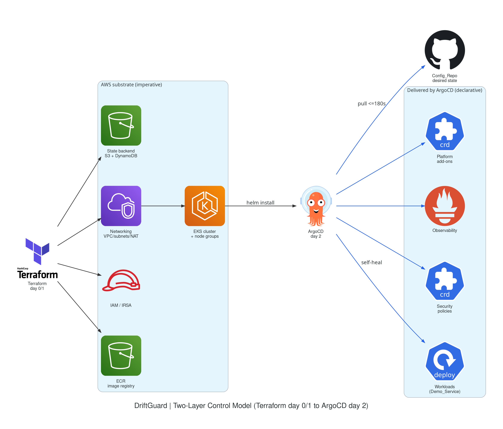
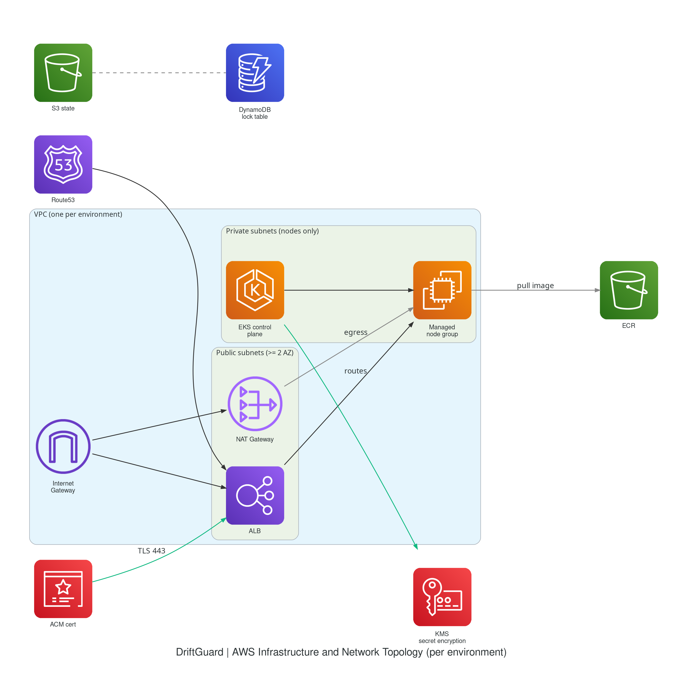
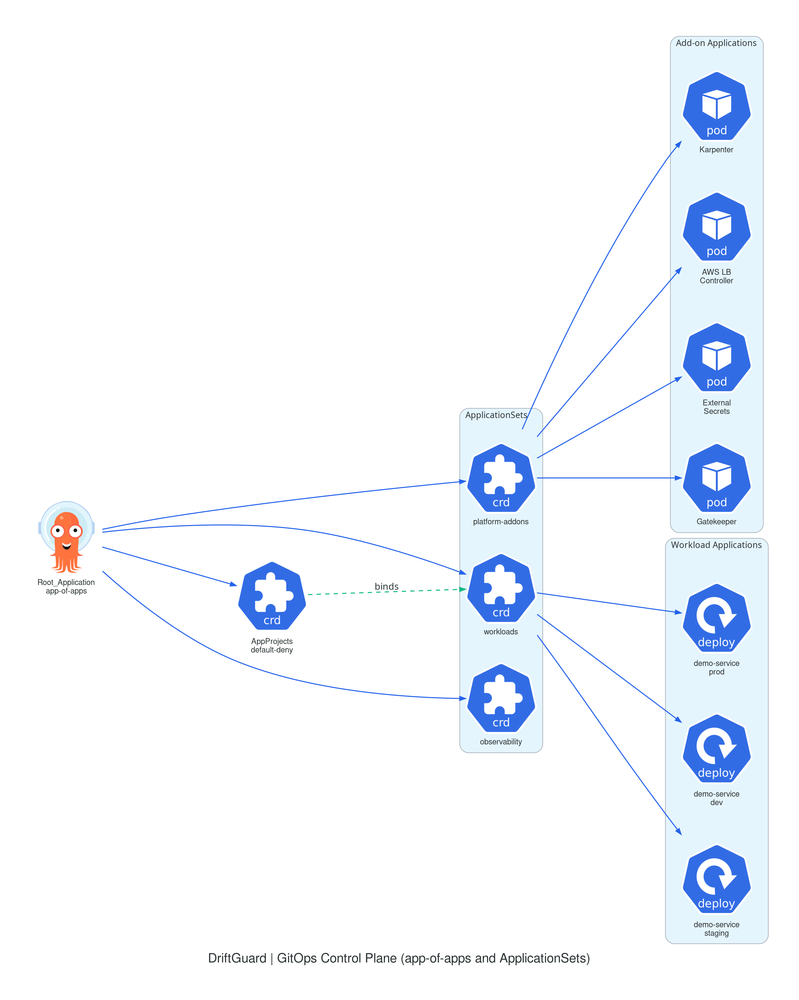
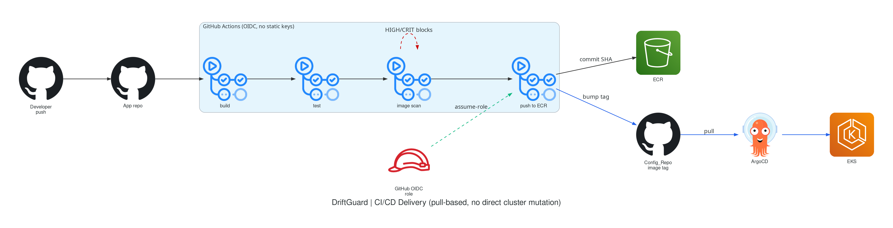
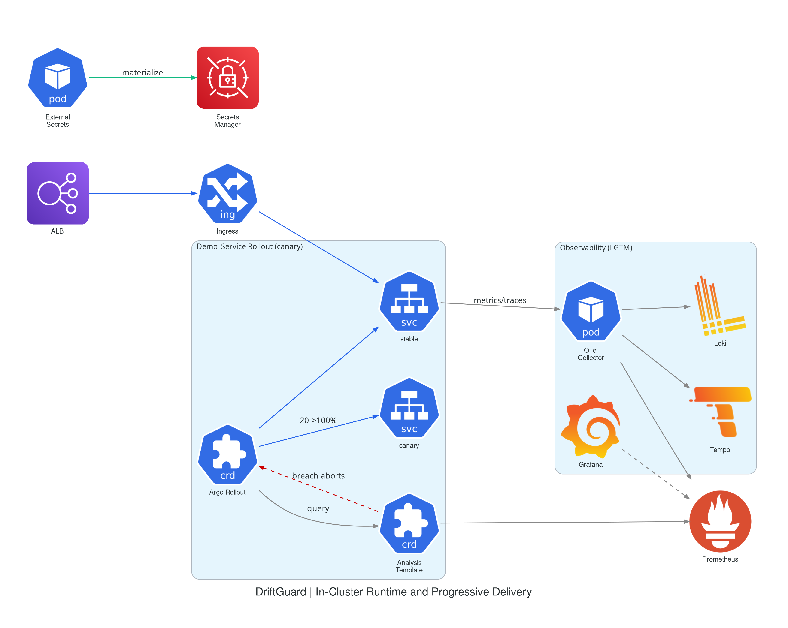

# DriftGuard Architecture Diagrams

## The five views

### 1. Two-layer control model

The defining decision of the platform: Terraform owns the imperative day 0/1
substrate and performs a one-time ArgoCD install, then ArgoCD owns declarative
day 2 reconciliation of everything inside the cluster. This is the boundary that
everything else follows.

### 2. AWS infrastructure and network topology

The per-environment VPC: public subnets for the load balancer and NAT, private
subnets for the worker nodes, and the supporting services (ECR, Route53, ACM,
KMS, and the S3 plus DynamoDB state backend).

### 3. GitOps control plane

How the Root_Application fans out through AppProjects and ApplicationSets into
the add-on and workload Applications. This is the app-of-apps pattern that lets
adding or removing a service be a single Git change.

### 4. CI/CD delivery

The pull-based delivery contract: CI builds, tests, scans, and publishes the
image using short-lived OIDC credentials, then commits the new tag to the
Config_Repo. ArgoCD reconciles from Git. CI never runs `kubectl apply`.

### 5. In-cluster runtime and progressive delivery

The runtime picture: the ALB and ingress in front of the canary Rollout, metric
analysis against Prometheus with abort-and-rollback on breach, the LGTM
observability stack fed by the OpenTelemetry Collector, and External Secrets
pulling from AWS Secrets Manager.

## Edge-color legend

The same legend applies to every diagram so the flows read consistently:

| Color | Meaning |
|---|---|
| Dark gray | Imperative provisioning by Terraform (day 0/1) |
| Blue | Declarative reconciliation by ArgoCD (day 2) |
| Light gray dashed | Supporting, background, or optional flow |
| Green | Identity, secrets, and policy flow |
| Red dashed | Failure, abort, and rollback path |

## Related documentation

- Infrastructure layer: [driftguard-infra/README.md](../../driftguard-infra/README.md)
- GitOps layer: [driftguard-gitops/README.md](../../driftguard-gitops/README.md)
- Project overview: [root README](../../README.md)
